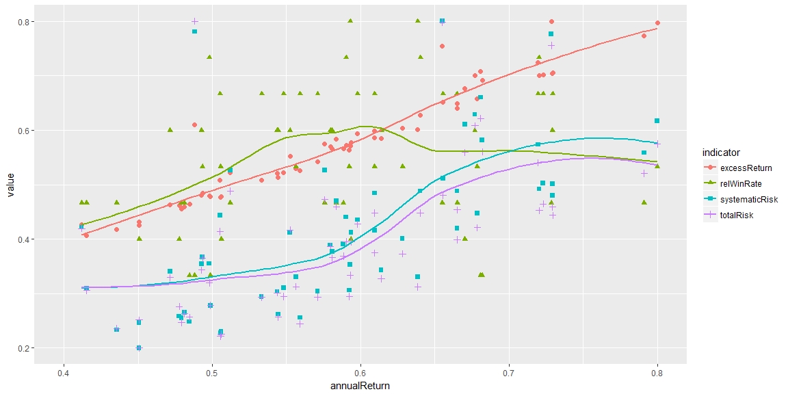
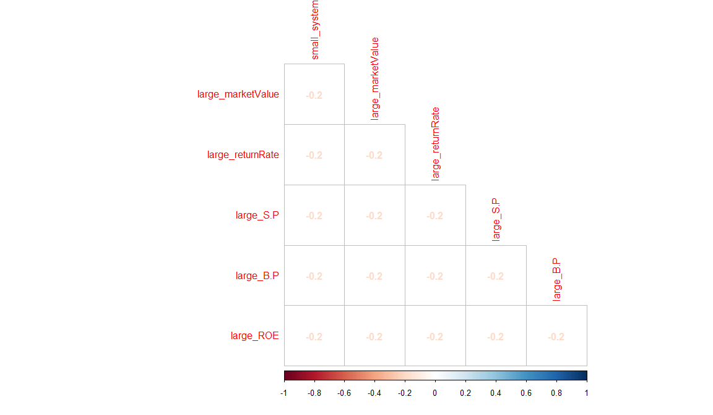
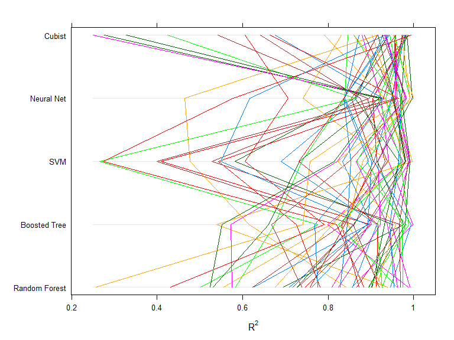
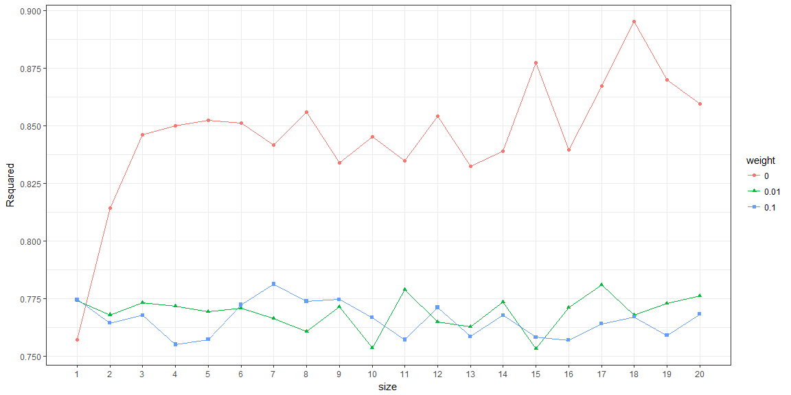
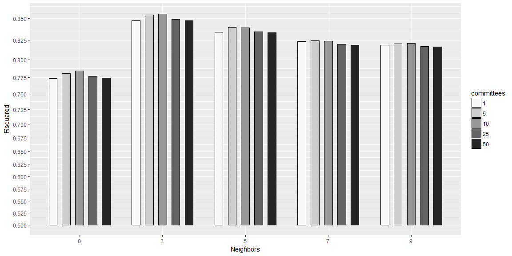
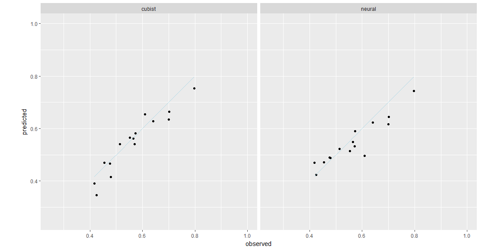

Required packages
-----------------

``` r
library(caret)
library(tidyverse)
library(corrplot)
library(rgl)
library(readxl)
library(Hmisc)
library(knitr)
```

------------------------------------------------------------------------

PART 1: Data Description
------------------------

**According to I-Chang Yeh(2015), [Stock portfolio dataset](https://archive.ics.uci.edu/ml/machine-learning-databases/00390/stock%20portfolio%20performance%20data%20set.xlsx) contains six predictors and six responses.**

**Firstly predictors, they represent stock picking factors.**

They include:

-   Value factors: The return rates of undervalued stocks tend to outperform those of overvalued stocks. Book value-to-price ratios (B/P), sales-to-price ratios (S/P) have been used here to evaluate whether the firm’s stock is undervalued or not. The larger the above ratios are, the higher the possibility that the stock is undervalued.

-   Growth factors: The return rates of stocks of profitable firms tend to outperform those of non-profitable firms. Return on equity (ROE) is often used to evaluate a firm’s profitability. The larger the ROE is, the more profitable the firm is.

-   Momentum factors: The return rates of stocks may appear as reversion or momentum Reversion indicates that if the return rate of the stock is currently high, it will become lower in the future. Momentum indicates that if the return rate of the stock is currently high, it will continue to go higher in the future.

-   Scale factors: There is negative relationship between the scale (market capitalization) of a firm and the return rate of the firm’s stock. Thus, the return rates of small-size firms’ stocks tend to outperform those of large-size firms’ stocks. Moreover, it is expected that the smaller the size of the firm, the lower the liquidity and the higher the risk of the firm’s stock.

-   Risk factors: measures the fluctuation in stock returns relative to benchmarks (market); that is, systematic risks..

To sum up, six factors have been chosen to conduct the stock selection: large book value-to-price ratio (B/P), large sales-to-price ratio (S/P), large return on equity (ROE), large return rate in the last quarter, large market capitalization, and small systematic risk. The main duty of the first four factors is to select the stocks with the characteristics of high return rates. The main duty of the large market capitalization factor is to select the stocks with the characteristics of high liquidity and low risk. Finally, the main duty of the small systematic risk factor is to select the stocks with characteristics of low risk in the next holding period.

**Secondly responses, they represent performance indicators.**

Two types of indicators, return and risk, are frequently used to evaluate investment performances of portfolios.

The return indicators include:

-   Annualized return rate.

-   Excess return rate.

-   Absolute winning rate.

-   Relative winning rate.

The risk indicators include:

-   Systematic risk

-   Total risk

------------------------------------------------------------------------

PART 2: Data Importing
----------------------

At this part, I will load the stock dataset and select the needed variables.

``` r
performance <- read_xlsx("performance.xlsx", skip = 1)
length(performance)
```

    ## [1] 19

After importing the data, I notice it consists of 19 variables instead of 12. This because, in
iddition to the six columns of the original performance indicators(mentioned at Description
Section), new six coulomns of the same indicators have been normalized to have the same
scale, and added to the dataset. Also an ID column has been added to the dataset.

I will select only the six columns that represent stock-picking factors, as well as the six
columns of normalized performance indicators.

``` r
performance <- performance[,c(2:7,14:19)]
```

Then renaming variables to be easy to handle.

``` r
performance <- performance %>%
    rename("large_B.P" = "Large B/P",
           "large_ROE" = "Large ROE",
           "large_returnRate" = "Large Return Rate in the last quarter",
           "large_S.P" = "Large S/P",
           "large_marketValue" = "Large Market Value",
           "small_systematicRisk" = "Small systematic Risk",
           "annualReturn" = "Annual Return__1",
           "excessReturn" = "Excess Return__1",
           "totalRisk" = "Total Risk__1", 
           "systematicRisk" = "Systematic Risk__1",
           "absWinRate" = "Abs. Win Rate__1",
           "relWinRate" = "Rel. Win Rate__1" 
           )
```

------------------------------------------------------------------------

PART3: Exploring
----------------

At this part, I will use visualization to gain an insight into the relation between different
stock performance indicators, i.e. the relation between annual return an the total risk. Also
the relation between stock picking factors and performance indicators, i.e at which market
value the total risk will be minimum.

I will start by plotting the anuual return performance versus other performance indicators.

``` r
performance[c(7, 8, 9, 10, 12)] %>%
    gather(key = indicator, value = value, -annualReturn) %>%
    group_by(annualReturn, indicator)%>%
    summarise(value = mean(value))%>%
    ggplot(aes(x = annualReturn, y = value, color = indicator), geom = "jitter")+
    geom_point(aes(shape = indicator), size = 2)+
    geom_smooth(se = F)+
    scale_x_continuous(limits = c(.4, .8))
```



As annual return increases both systematic and total risks increase by a small proportion
up to 0.6 then by a big proportion after this point. The relation between annual and excess
returns is linear, and the same for total and systematic risks. Relative win rate increases as
annual return increases, but decreases again at a value of about 0.6, this is the same point
at which the risks increase significantly. This ensures a negative relation between relative
win rate and risks.

Plotting the annual return on the x-axis, total risk on the y-axis, and relative win rate on
the z-axis can help understand the relation between the three variables better.

``` r
interleave <- function(x1, x2) as.vector(rbind(x1, x2))
open3d(windowRect=c(100,100,700,700))
rgl.material(color = "black")
plot3d(performance[[7]], performance[[10]], performance[[12]], 
       xlab ="", ylab = "", zlab = "",
       lit = T, axes = F, type = "s", size = .7)

segments3d(
     interleave(performance[[7]], performance[[7]]), 
     interleave(performance[[10]], performance[[10]]),
     interleave(performance[[12]], min(performance[[7]])),
     alpha = .5, col = "#000000")

axes3d(edges = c("x--", "y-+", "y+-","z--"), nticks = 8, cex = .6)
grid3d(side = c("z-", "x-", "y+"))
mtext3d("Annual Return", edge = "x--", line = 3)
mtext3d("Total Risk", edge = "y+-", line = 3.7)
mtext3d("Relative Win-Rate", edge = "z--", line = 3)
rgl.snapshot("plot3d.png")
```

The figure shows that with increasing annual return, total risk increases also. Because
relative win rate depends positively on annual return and negatively on total risk, then the
maximum value of relative win rate happens at some cut point between a relatively low
total risk weight and high annual return weight. The figure refers to this cut point at total
risk and annual return weights of about 3.8 and 0.6 respectively. Some investors don’t care
much for the annual return or the win rate as they do for the minimum risk. If this is the
case, then this cut point will not be the optimal option.

After understanding the relation between performance indicators, I’m going to take a look
at the relation between stock picking factors and perforamance indicators. Because after
all, later on (at part 6), I’m going to use these picking factors to predict the outcome of the
stock performance indicators. The answer to the following question may clarify this
relation. At which weight for the six picking factors, we can get the best performance for
every single performance indicator?

``` r
performance%>%
    gather(key = "indicator", value = value, colnames(performance[7:12]))%>%
    filter(ifelse(indicator %in% colnames(performance)[9:10] & value == min(value), TRUE,
            ifelse(indicator %in% colnames(performance)[c(7,8,11,12)] & value == max(value), 
                   TRUE, FALSE))) %>%
    select(indicator, value, everything()) %>%
    kable()
```

| indicator      |  value|  large\_B.P|  large\_ROE|  large\_S.P|  large\_returnRate|  large\_marketValue|  small\_systematicRisk|
|:---------------|------:|-----------:|-----------:|-----------:|------------------:|-------------------:|----------------------:|
| annualReturn   |    0.8|       0.000|       0.000|       0.500|              0.500|               0.000|                  0.000|
| excessReturn   |    0.8|       0.000|       0.000|       1.000|              0.000|               0.000|                  0.000|
| systematicRisk |    0.2|       0.000|       0.000|       0.000|              0.000|               0.500|                  0.500|
| totalRisk      |    0.2|       0.000|       0.000|       0.000|              0.000|               0.500|                  0.500|
| absWinRate     |    0.8|       0.000|       0.000|       0.000|              0.000|               1.000|                  0.000|
| absWinRate     |    0.8|       0.000|       0.500|       0.000|              0.500|               0.000|                  0.000|
| absWinRate     |    0.8|       0.000|       0.500|       0.000|              0.000|               0.500|                  0.000|
| absWinRate     |    0.8|       0.000|       0.000|       0.000|              0.500|               0.500|                  0.000|
| absWinRate     |    0.8|       0.500|       0.000|       0.000|              0.000|               0.000|                  0.500|
| absWinRate     |    0.8|       0.000|       0.333|       0.000|              0.333|               0.333|                  0.000|
| absWinRate     |    0.8|       0.333|       0.333|       0.000|              0.000|               0.000|                  0.333|
| absWinRate     |    0.8|       0.000|       0.333|       0.000|              0.000|               0.333|                  0.333|
| absWinRate     |    0.8|       0.250|       0.250|       0.000|              0.250|               0.250|                  0.000|
| absWinRate     |    0.8|       0.000|       0.250|       0.000|              0.250|               0.250|                  0.250|
| relWinRate     |    0.8|       0.000|       0.500|       0.000|              0.000|               0.500|                  0.000|
| relWinRate     |    0.8|       0.167|       0.167|       0.167|              0.167|               0.167|                  0.167|

The table shows performance indicators’ optimal values (i.e. maximum return rate,
minimum total risk, etc..) and their related stock-picking factors weights.
With different combination of the different factors weight, some indicators, like absolute
win rate and relative win rate could, achieve this optimal value more than once.

------------------------------------------------------------------------

PART4: Preprocessing
--------------------

Before preprocessing I need to take a look at my predictors' samples

``` r
describe(performance[1:6])
```

    ## performance[1:6] 
    ## 
    ##  6  Variables      63  Observations
    ## ---------------------------------------------------------------------------
    ## large_B.P 
    ##        n  missing distinct     Info     Mean      Gmd 
    ##       63        0        7    0.872   0.1666   0.2033 
    ##                                                     
    ## Value      0.000 0.167 0.200 0.250 0.333 0.500 1.000
    ## Frequency     31     1     5    10    10     5     1
    ## Proportion 0.492 0.016 0.079 0.159 0.159 0.079 0.016
    ## ---------------------------------------------------------------------------
    ## large_ROE 
    ##        n  missing distinct     Info     Mean      Gmd 
    ##       63        0        7    0.872   0.1666   0.2033 
    ##                                                     
    ## Value      0.000 0.167 0.200 0.250 0.333 0.500 1.000
    ## Frequency     31     1     5    10    10     5     1
    ## Proportion 0.492 0.016 0.079 0.159 0.159 0.079 0.016
    ## ---------------------------------------------------------------------------
    ## large_S.P 
    ##        n  missing distinct     Info     Mean      Gmd 
    ##       63        0        7    0.872   0.1666   0.2033 
    ##                                                     
    ## Value      0.000 0.167 0.200 0.250 0.333 0.500 1.000
    ## Frequency     31     1     5    10    10     5     1
    ## Proportion 0.492 0.016 0.079 0.159 0.159 0.079 0.016
    ## ---------------------------------------------------------------------------
    ## large_returnRate 
    ##        n  missing distinct     Info     Mean      Gmd 
    ##       63        0        7    0.872   0.1666   0.2033 
    ##                                                     
    ## Value      0.000 0.167 0.200 0.250 0.333 0.500 1.000
    ## Frequency     31     1     5    10    10     5     1
    ## Proportion 0.492 0.016 0.079 0.159 0.159 0.079 0.016
    ## ---------------------------------------------------------------------------
    ## large_marketValue 
    ##        n  missing distinct     Info     Mean      Gmd 
    ##       63        0        7    0.872   0.1666   0.2033 
    ##                                                     
    ## Value      0.000 0.167 0.200 0.250 0.333 0.500 1.000
    ## Frequency     31     1     5    10    10     5     1
    ## Proportion 0.492 0.016 0.079 0.159 0.159 0.079 0.016
    ## ---------------------------------------------------------------------------
    ## small_systematicRisk 
    ##        n  missing distinct     Info     Mean      Gmd 
    ##       63        0        7    0.872   0.1666   0.2033 
    ##                                                     
    ## Value      0.000 0.167 0.200 0.250 0.333 0.500 1.000
    ## Frequency     31     1     5    10    10     5     1
    ## Proportion 0.492 0.016 0.079 0.159 0.159 0.079 0.016
    ## ---------------------------------------------------------------------------

I notice that the data is relatively small with only 63 observations, none of them has
missing values. Also none of the variables has zero or near-zero variance. As a result,
neither the variables nor the observations will be removed or imputed.

Finally, between-predictors correlation may reduce the performance of the models, so
checking collinearity is a necessary step before model training.

``` r
cor(performance[1:6]) %>%
corrplot(order = "hclust", type = "lower", method = "number", diag = F)
```

 

From the graph, the correlation between predictors is close to zero, almost there’s no
correlation between predictors.


*After these checks, I can ensure that there's no specific preprocessing technique needs to be applied, and the dataset is ready for trainig.*

------------------------------------------------------------------------

PART 5: Training/Test Splitting
-------------------------------

At this section, I split the dataset into: training set, represents about 75% of the original dataset
samples, to train my models. The remainder of the samples(25%) goes into the test set to check the performance of the fitted models.

``` r
set.seed(5667110)
trainRows <- createDataPartition(performance$annualReturn, p = .75, list = F) 

trainset <- performance[trainRows,]  
testset <- performance[-trainRows,]  
```

------------------------------------------------------------------------

PART 6: Model tuning, Choosing between models
---------------------------------------------

At this part, I  train different non-linear regression models using repeated cross-validation resampling technique, 
choose the optimal tuning parameter for each model, and finally choose the best model between these bunch of models.

``` r
trControl <- trainControl(method = "repeatedcv", 
                          number = 10, repeats = 5 )
```

My models will use all predictors, which represent stock-picking factors, to predict the excessReturn response. 
The models I’m going to train are : Neural network, cubist tree, boosted tree, random forest, and supply vector machine.


**Neural Network**

``` r
set.seed(9086998)
nnetFit <- train(
             excessReturn ~ .,
             data = trainset[c(1:6,8)],
             method = "avNNet",
             metric = "Rsquared",
             tuneGrid = expand.grid(
                  .size = seq(1, 20, by = 1),   #number of hidden units
                  .decay = c(0, .01, .1),   #weight decay, the degree of regularization
                  .bag = T ),       #use bagging instead of random samples
             linout = T,  #for regression 
             trace = F,   #reduce the amount of printed output
             trControl = trControl
             )
```


**Cubist**

``` r
set.seed(9086998)
cubistFit <- train(
                excessReturn ~ .,
                data = trainset[c(1:6,8)],
                method = "cubist",
                metric = "Rsquared",
                tuneGrid = expand.grid(
                     .committees = c(1, 5, 10, 25, 50),
                     .neighbors = c(0, 3, 5, 7, 9)),
                trControl = trControl
                )
```


**Boosted Trees**

``` r
set.seed(9086998)
gbmFit <- train(
                excessReturn ~ .,
                data = trainset[c(1:6,8)],
                method = "gbm",
                metric = "Rsquared",
                tuneGrid = expand.grid(
                     .interaction.depth = seq(1, 7, by = 1), #depth of trees
                     .n.trees = seq(500, 1000, by = 100),    #number of trees
                     .shrinkage = c(0, .001, .01, .1),       #learning rate
                     .n.minobsinnode = seq(1, 15, by = 2)),  #no. obs in terminal nodes
                verbose = F, #reduce printed output on the screen
                trControl = trControl
                )
```


**Random Forest**

``` r
set.seed(9086998)
rfFit <- train(
                excessReturn ~ .,
                data = trainset[c(1:6,8)],
                method = "rf",
                metric = "Rsquared",
                tuneLength = 20,
                ntrees = 1000,
                trControl = trControl
                )
```


**Supply Vector Machine**

``` r
set.seed(9086998)
svmFit <- train(
                excessReturn ~ .,
                data = trainset[c(1:6,8)],
                method = "svmRadial",
                metric = "Rsquared",
                tuneLength = 30,
                trControl = trControl
                )
```


Now, after training these bunch of models, a good idea is to compare between the performance of the five models, to focus on the best two fitted models


``` r
resamples(list(
               "SVM" = svmFit,
               "Cubist" = cubistFit,
               "Neural Net" = nnetFit,
               "Random Forest" = rfFit,
               "Boosted Tree" = gbmFit
               )) %>%
parallelplot(metric = "Rsquared")
```

 

As the figure shows, ranked from the top to the bottom, the performances of the cubist and
the neural network, in average, are the best.

To know the final tuning parameters chosen for these two models, cubist and neural
network, a visualization of different parameters estimates versus R squared will help.

I will start by plotting neural network tuning parameters.

``` r
ggplot(data = nnetFit$results,
           aes(x = size, y = Rsquared, color = as.factor(decay)))+ 
    geom_line()+
    geom_point(aes( shape = as.factor(decay)))+
    scale_x_continuous(breaks = seq(0, 22, by = 1))+
    scale_y_continuous(breaks = seq(.5, 1, by = .025))+
    guides(color = guide_legend("weight"), shape = guide_legend("weight"))+
    theme_bw()+
    theme(panel.grid.minor.x = element_blank())
```



The figure shows the highest Rsquared value, which is 0.88, is at weight and size parameters of 0 and 18 respectively.

The same plotting but for cubist tuning parameters

``` r
ggplot(data = cubistFit$results,
           aes(x = as.factor(neighbors), y = Rsquared, 
               fill = as.factor(committees)))+ 
    geom_bar( stat = "identity", position = position_dodge(.8), 
              width = .5, color = "black")+
    scale_y_continuous(breaks = seq(0, 1, by = .025), trans = "logit")+
    scale_fill_brewer(palette = "Greys")+
    guides(fill = guide_legend("committees"))+
    theme(panel.grid.minor.x = element_blank())+
    xlab("Neighbors")
```



The figure shows the highest Rsquared value, which equals about 0.86, is at committees
and neighbors parameters of 10 and 3 respectively.

Both of the models have almost the same Rsquared value, so it’s hard to make a final decision about which model performs better. An alternative and effective solution is to plot the predicted values versus the observed values to see how close they are.

``` r
tibble(
    neural = predict(nnetFit, testset),
    cubist = predict(cubistFit, testset),
    observed = testset[[8]])%>%
    gather(key = "model", value = "predicted", neural, cubist)%>%
    ggplot(aes(x = observed, y = predicted))+
    geom_point()+
    geom_line(aes(y = observed), color = "lightblue")+
    facet_grid(.~ model)+
    coord_fixed(ylim = c(.25, 1), xlim = c(.25, 1))
```



The difference is too small to notice, and may be due to chance. At this case I’ll use P-value
to determine if the difference value is significant or not.

``` r
resamp <- resamples(
    list(NNet = nnetFit,
         cubist = cubistFit))
resamp$values <- resamp$values[,c(1, 4, 7)]
resamp$metrics <- "Rsquared"
resamp%>%diff()%>%summary()
```

    ## 
    ## Call:
    ## summary.diff.resamples(object = .)
    ## 
    ## p-value adjustment: bonferroni 
    ## Upper diagonal: estimates of the difference
    ## Lower diagonal: p-value for H0: difference = 0
    ## 
    ## Rsquared 
    ##        NNet   cubist 
    ## NNet          0.04066
    ## cubist 0.1935

The P-value equals 0.1935, which is much larger than 0.05. This indicates we can’t rejectthe null hypothesis. 
This means there’s no real difference between the performances of both models and choosing any of them will give the same performance.

Here, I choose neural network as my final model to predict annual return outcome. 
The same steps of tuning parameters and between-models selection I will do again with the
other performance indicators at the dataset.

------------------------------------------------------------------------

PART 7: Conclusion
---------------------------------------------

I could conclude from exploring the stock-portfolio dataset that: 

-   the risk and the return rate are positively related, so high annual return, means also high risk. 

-   Win rate has a positive relation with the annual return performance. On the other hand, has a negative relation with the risk. 
As a result, the highest win rate could be achieved at some cut point between low risk and high annual return.

-   For investors who care more about small risk performance, they should invest in
stocks with a high weight at both: Large market value and small systematic risk.

After exploring, I split the data into train and test sets. I used the train set to build my models ,and the test set to check how well these models perform. 
After training different models and comparing between them, I choose the neural network model as the optimal model to predict the stock-performances.

